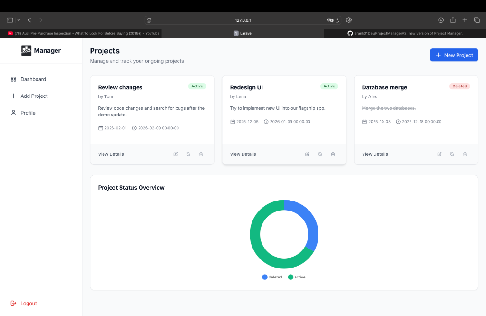
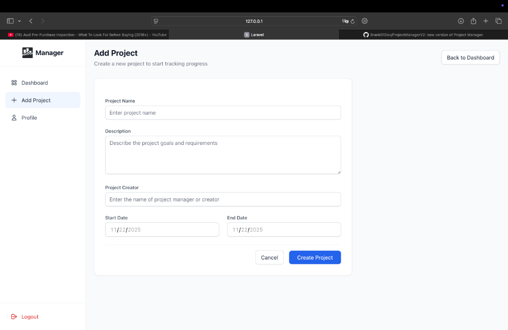
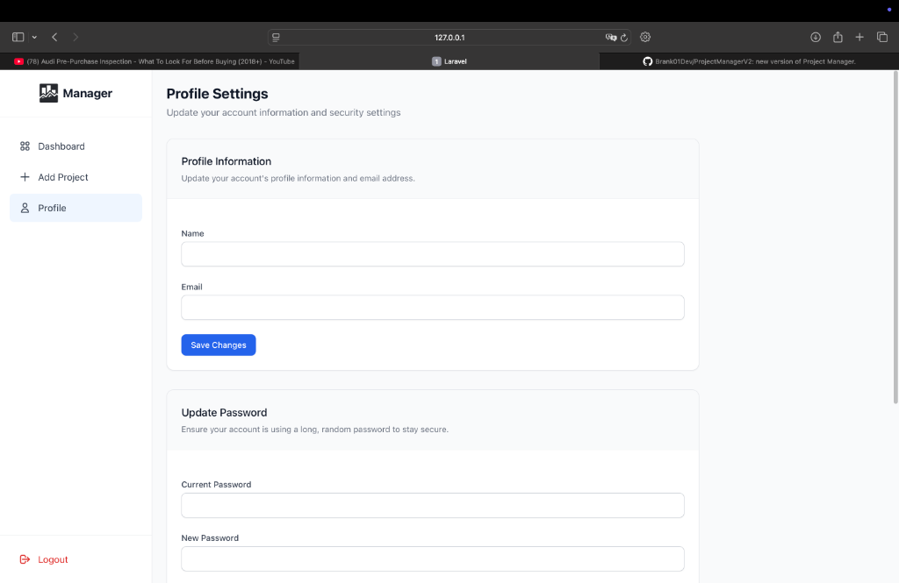

# ProjectManagerV2


ProjectManagerV2 is a simple project management web app built with **Laravel 10** and **TailwindCSS**.  
It allows users to create, edit, and delete projects, and manage basic task lists within each project.

---

## 🔍 What it new?

**ProjectManagerV2** updates:

- Now you have to login or register in ProjectManagerV2 to save your projects. 🛟
- ProjectManagerV2 lets you securely add your account and manage only your projects. 📝
- ProjectManagerV2 uses Laravel Breeze for user authentication. 🪪

---

# Installation & setup

1. **Clone the repository**
```
git clone https://github.com/Brank01Dev/ProjectManagerV2.git
cd ProjectManagerV2
cd userauth
```
2. **Install dependencies**
```
composer install
npm install
```
   
3. **Run the development servers**
```
php artisan serve
npm run dev
```
   
4. **Open your browser at:**
```
http://localhost:8000
```
---

# 🚀 Current Features

- User registration & login 🔐
- CRUD for projects 🖨️
- Simple task management 👨🏽‍💼
- Responsive layout 📂

---

# 🧰 Tech Stack

- **Backend:** Laravel 10 (PHP)
- **Frontend:** Blade + TailwindCSS
- **Authentication:** Laravel Breeze
- **Database:** MySQL
- **Runtime:** PHP 8+, Node.js, npm

---


#  🖼️ Preview


(Dashboard View)


(Add Project View)


(Profile View)
 
---

# 👤 Author
- Branko – Junior Full-Stack Developer passionate about building practical web applications.
-📍Based in Switzerland 🇨🇭  
- [GitHub](https://github.com/Brank01Dev)
  
---

## 📌 Project Status
🚧 **Work in progress.**  
This version focuses on authentication and project CRUD — additional features and UI improvements are planned for upcoming releases.

